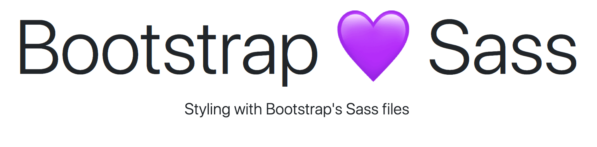

# Exercise 3: Importing Bootstrap

Let's add Bootstrap to our project. [Bootstrap](https://getbootstrap.com/) is a powerful pre-built web development framework. By importing Bootstrap's CSS, (or Sass files) and using the HTML structure Bootstrap expects, we can quickly prototype and build webpages.

## 1. Add the `bootstrap` package to our project as a dependency

```
npm i bootstrap
```

Once Bootstrap has been added you should see a message such as:

```
npm WARN bootstrap@4.5.0 requires a peer of jquery@1.9.1 - 3
npm WARN bootstrap@4.5.0 requires a peer of popper.js@^1.16.0

You must install peer dependencies yourself.
```

What this means is we'll have to add these JavaScript dependencies if we want to use Bootstrap's JavaScript components. Bootstrap's JS can't run without jQuery and Popper.

Since we're just working with Bootstrap's Sass, let's carry on.

## 2. Add Bootstrap's Sass to our SCSS

Import the `bootstrap` manifest file into our `manifest.scss` file, after our variables import.

This target file is waiting in the following location:

`node_modules/bootstrap/scss/bootstrap.scss`

Run the `scss` script again. Does everything work as expect?

## 3. Using Bootstrap's components

Let's clear out the contents of the `<body>` node in `index.html`, and replace it with this:

```
<header class="container">
  <div class="row">
    <div class="col-12 text-center">
      <h1 class="display-1">Bootstrap 💜 Sass</h1>
      <p class="lead">Styling with Bootstrap's Sass files</p>
    </div>
  </div>
</header>
```

Notice all those classes, and the HTML structure? We'll need those if we want Bootstrap to look the way it was intended.

I used the Grid layout Bootstrap provides by reading this document on [layouts using Bootstrap's Grid System](https://getbootstrap.com/docs/4.5/layout/grid/).

I also used the `display-1` heading, and `lead` paragraph from the [Bootstrap Typograpy section](https://getbootstrap.com/docs/4.5/content/typography/)

# 4. Results! 

If you haven't already, run your SCSS script to compile the CSS.

Your `index.html` should look like this in a browser:



Commit your work, and push.