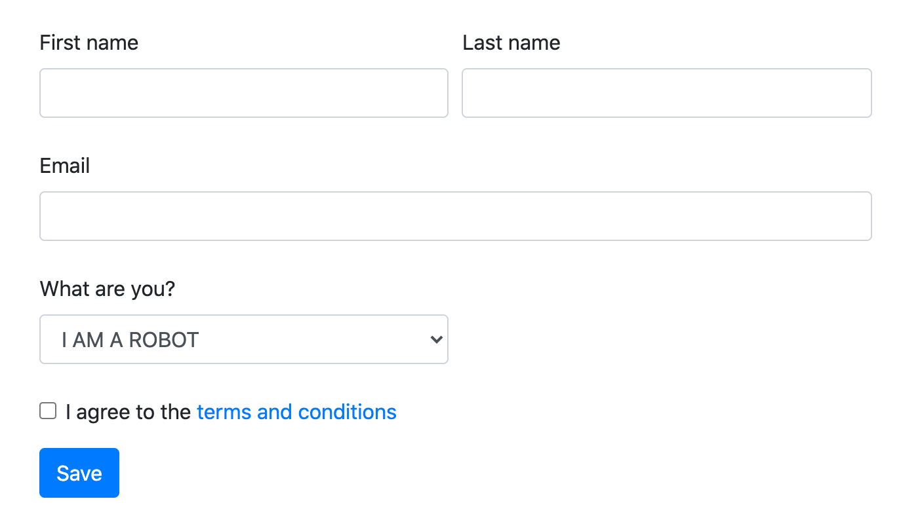
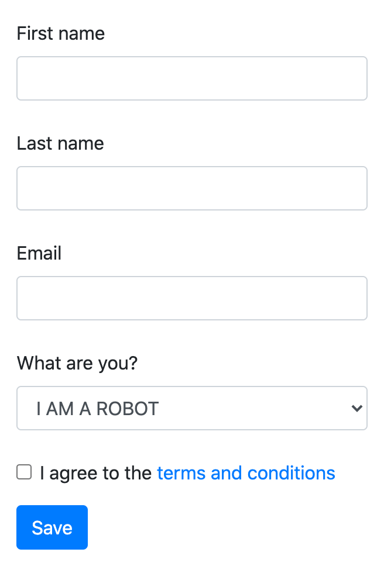
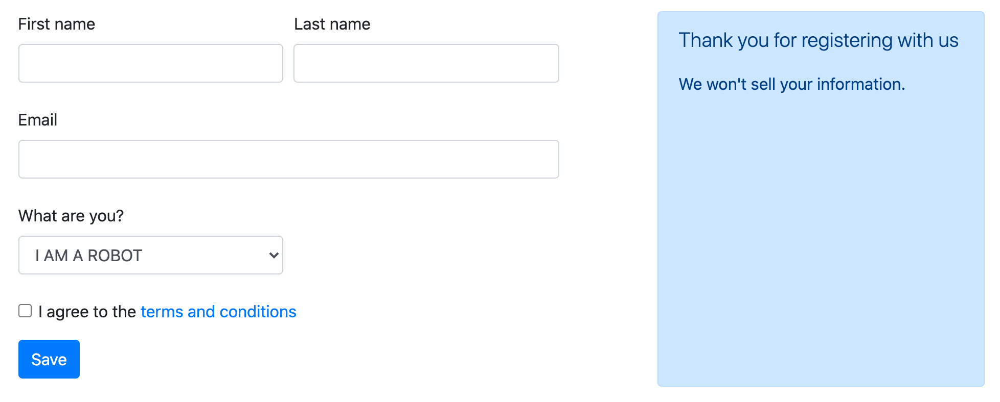
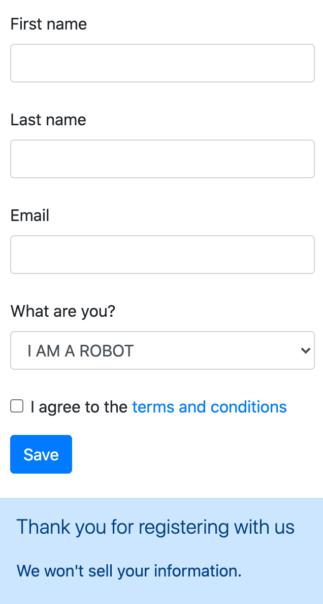

# Exericse 4: Building a form

One of the best uses of Bootstrap is for prototyping and creating basic web applications. And most web applications need lots of forms!

So, let's use Bootstrap's form components.

But before we can do that, let's clean up our SCSS again. Make sure you only have the two `@import` rules in `scss/manifest.scss`, nothing else.

OK, on to forms.

1. Create a new file in the root directory called `form.html`.
1. Add the basic HTML we need for any HTML document, and include a `<link>` to the `manifest.css` file in the `css` folder.

We're going to create the following form:

With Bootstrap's responsiveness, it should look like this on a mobile phone:

To achieve this layout, we'll need to implement the following components:

- [Form controls](https://getbootstrap.com/docs/4.5/components/forms/)
- [Buttons](https://getbootstrap.com/docs/4.5/components/buttons/)
- [Grid layouts](https://getbootstrap.com/docs/4.0/layout/grid/)

Alright! Get to it. See how far you can get.

If you have extra time left over, try implement an additional sidebar:

Which should come after the form on a mobile phone:

