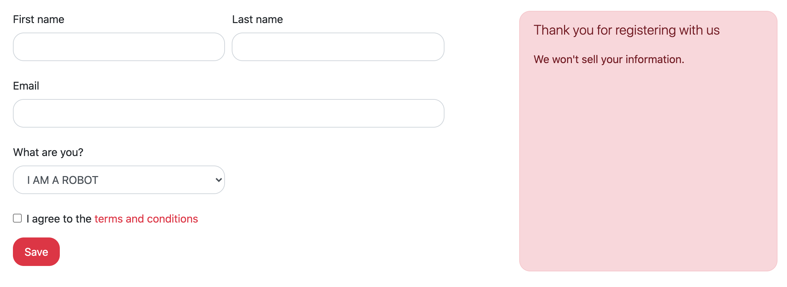

# Exercise 6: Customising Bootstrap

The power of Bootstrap is in its Sass. And Sass is powerful because of its variables, functions, etc.

Bootstrap offers an impressive list of user-changeable variables, which you can see in `node_modules/bootstrap/scss/_variables.scss`.

## Setting up our customisations

Let's copy that file and store it in our own `scss/variables` folder, calling it: `_bootstrap-defaults.scss`.

Alright, let's clone `_bootstrap-defaults.scss` to `_bootstrap-custom.scss`. This way we have a normal variables file, and our own customised version, both sitting in our variables directory.

Now, at any time, we should be able to switch between the default Bootstrap variables and our customised variables.
Why don't we set that up in our `_bootstrap-manifest` file?

Find the line in `_bootstrap-manifest` where it imports the `variables`. Change this line so that it points to our `_bootstrap-custom.scss` file, sitting in our `variables` directory.

Compile your SCSS and make sure everything is still working.

## Customise away!

Here are some things I want you to customise:

- All buttons and input fields need to have vertical padding of `.5rem`, and horizontal padding of `1rem`.
- All `border-radius` values need to be `1rem`.
- The primary colour must now be `$red`.

After you've done all that, your page should look like this:

